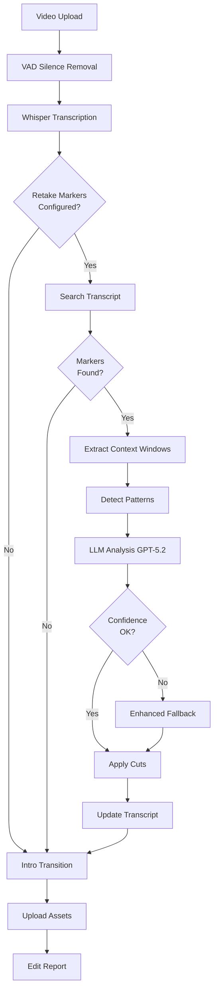

# LLM-Based Retake Detection System

**Version**: 1.0  
**Last Updated**: January 2026

## Table of Contents

1. [Overview](#overview)
2. [Architecture](#architecture)
3. [How It Works](#how-it-works)
4. [Configuration Guide](#configuration-guide)
5. [Prompt Engineering](#prompt-engineering)
6. [Use Cases & Examples](#use-cases--examples)
7. [Fallback Heuristics](#fallback-heuristics)
8. [Performance & Cost](#performance--cost)
9. [Troubleshooting](#troubleshooting)
10. [API Reference](#api-reference)

---

## Overview

The LLM-based retake detection system uses artificial intelligence (GPT-5.2) to intelligently identify and remove mistakes in video recordings. When a speaker says a retake phrase like "cut cut" or "oops", the system:

1. **Locates** the retake marker in the transcript
2. **Analyzes** the surrounding context using GPT-5.2
3. **Determines** where the mistake actually begins (not just a fixed duration)
4. **Applies** precise cuts to remove both the mistake and retake phrase
5. **Preserves** the successful retake content

### Key Advantages

- **Flexible Duration**: Handles 2-second mistakes to 30+ second false starts
- **Context-Aware**: Understands what the speaker was trying to say
- **Natural Cuts**: Prefers sentence boundaries for smooth flow
- **Confidence Scores**: Each cut includes AI confidence for manual review
- **Robust Fallback**: Enhanced heuristics when LLM unavailable

---

## Architecture



### Component Breakdown

| Component | File | Purpose |
|-----------|------|---------|
| **Video Processor** | `handlers/video_process.py` | Orchestrates entire pipeline |
| **Transcription** | `utils/transcription.py` | Whisper word-level timestamps |
| **LLM Cuts** | `utils/llm_cuts.py` | Core retake detection logic |
| **VAD Processor** | `utils/vad_processor.py` | Silero VAD for speech segments |

---

## How It Works

### Step 1: Phrase Search

When transcription completes, the system searches for user-configured retake markers:

```python
def search_transcript_for_phrases(words, phrases):
    """
    Searches transcript for exact phrase matches.
    
    Args:
        words: [{word: str, start: float, end: float}, ...]
        phrases: ["cut cut", "oops", "let me try again"]
    
    Returns:
        [{phrase: str, start: float, end: float, word_index: int}, ...]
    """
```

**Example**:
```python
transcript_words = [
    {"word": "So", "start": 10.0, "end": 10.2},
    {"word": "today", "start": 10.2, "end": 10.5},
    # ... more words ...
    {"word": "cut", "start": 52.8, "end": 53.1},
    {"word": "cut", "start": 53.1, "end": 53.5},
    # ... continues ...
]

retake_matches = search_transcript_for_phrases(
    transcript_words, 
    ["cut cut", "oops"]
)

# Returns:
# [{"phrase": "cut cut", "start": 52.8, "end": 53.5, "word_index": 234}]
```

### Step 2: Context Extraction

For each marker, extract a context window (default: 30 seconds before/after):

```python
def extract_context_window(words, marker_time, window_seconds=30):
    """
    Extracts surrounding transcript for LLM analysis.
    
    Returns:
        (context_words, start_index, end_index)
    """
```

This provides the LLM with enough context to understand:
- What the speaker was trying to say
- Where the mistake began
- What the successful retake says

### Step 3: Pattern Detection

Classify the retake type to guide LLM analysis:

```python
def detect_retake_pattern(context_words, retake_match, full_transcript):
    """
    Classifies retake pattern based on duration and context.
    
    Returns:
        "quick_fix" | "full_redo" | "multiple_attempts" | "medium_segment"
    """
```

**Pattern Types**:

| Pattern | Duration | Description | Example |
|---------|----------|-------------|---------|
| `quick_fix` | 2-5s | Short stumble, same thought | "um, actually... cut cut" |
| `medium_segment` | 5-10s | Partial restart | "So the key point is... cut cut" |
| `full_redo` | 10+s | Complete restart | Full intro restart |
| `multiple_attempts` | Varies | Multiple markers nearby | Try 1, try 2, try 3 |

### Step 4: Sentence Boundary Detection

Find natural cut points based on punctuation and pauses:

```python
def identify_sentence_boundaries(words, min_pause_seconds=0.5):
    """
    Identifies sentence endings for natural cuts.
    
    Criteria:
    - Sentence-ending punctuation (. ! ?)
    - Pause ≥ min_pause_seconds between words
    
    Returns:
        List of word indices marking boundaries
    """
```

### Step 5: LLM Analysis

Send full transcript to GPT-5.2 with reasoning prompts (context window used for pattern detection):

```python
def analyze_retake_cuts(
    transcript_words,
    retake_matches,
    api_key,
    context_window_seconds=30,
    min_confidence=0.7,
    prefer_sentence_boundaries=True,
    model="gpt-5.2",
    vad_segments=None
):
    """
    Main LLM analysis function.
    
    For each retake marker:
    1. Extract context window
    2. Detect pattern
    3. Build reasoning prompt with full transcript
    4. Call GPT-5.2 API with retry logic
    5. Parse JSON response
    6. Filter by confidence
    7. Merge overlapping cuts
    
    Returns:
        [{start_time, end_time, reason, confidence, pattern, 
          method, llm_reasoning}, ...]
    """
```

### Step 6: Cut Application

Apply cuts via FFmpeg:

```python
def apply_cuts_to_video(input_path, output_path, cut_instructions):
    """
    1. Sort cuts by start time
    2. Generate "keep segments" (inverse of cuts)
    3. Extract each keep segment as temp file
    4. Concatenate segments
    5. Return success + stats
    """
```

---

## Configuration Guide

### User Settings (Profile Table)

Users configure retake detection in Settings UI:

```sql
-- Database columns
retake_markers                     JSONB    -- ["cut cut", "oops"]
retake_context_window_seconds     INTEGER  -- 30 (range: 10-120)
retake_min_confidence             DECIMAL  -- 0.70 (range: 0.0-1.0)
retake_prefer_sentence_boundaries BOOLEAN  -- true
llm_model                         VARCHAR  -- legacy (ignored)
```

### Settings UI

Location: `/dashboard/settings`

**Retake Markers Field**:
- Comma-separated list of phrases
- Case-insensitive matching
- Punctuation ignored during search
- Example: `cut cut, oops, let me try again`

**Advanced Settings**:

| Setting | Type | Default | Range | Impact |
|---------|------|---------|-------|--------|
| **Context Window** | integer | 30 | 10-120 | Pattern detection window; LLM uses full transcript |
| **Min Confidence** | float | 0.7 | 0.0-1.0 | Higher = more selective, more fallbacks |
| **Prefer Boundaries** | boolean | true | - | Smoother cuts at sentence ends |
| **LLM Model** | enum | gpt-5.2 | gpt-5.2 | Set via `OPENAI_MODEL` env var |

### Environment Variables (Worker)

```bash
# Required for LLM analysis
OPENAI_API_KEY=sk-...

# Optional: Override defaults
OPENAI_MODEL=gpt-5.2
WORKER_TEMP_DIR=/tmp/yt-worker
WHISPER_MODEL=base
```

---

## Prompt Engineering

### System Prompt

```
You are an expert video editing assistant that analyzes transcripts to identify 
optimal cut points. You provide detailed reasoning and confidence scores.
```

### User Prompt Template

```
You are analyzing a retake marker in a video transcript.

**Context:**
A speaker said the retake phrase "{phrase}" at {start}s - {end}s.
This indicates they made a mistake and want to redo that part.

**Pattern Type:** {pattern}
- quick_fix: Short 2-5 second mistake, continues same thought
- full_redo: Longer 10+ second segment, restarts completely
- multiple_attempts: Multiple retakes in quick succession
- medium_segment: 5-10 second mistake

**Transcript Context ({window}s window):**
[timestamp] word
[timestamp] word
...

**Your Task:**
Analyze the content BEFORE the retake marker and determine what should be cut out.

**Think step-by-step:**
1. What was the speaker trying to say before "{phrase}"?
2. Where does the mistake/unwanted content actually BEGIN?
   - Look for false starts, repeated words, or topic shifts
   - Consider sentence boundaries for natural cut points
   - The mistake might be 2 seconds or 30+ seconds before the marker
3. Where should the cut END? (Usually just before the retake phrase)
4. What will remain after the cut? Will the flow be natural?

**Important Guidelines:**
- Be FLEXIBLE with cut length - analyze context, don't assume fixed duration
- Use precise timestamps from the transcript
- The redo content AFTER "{phrase}" should be KEPT
- Include the retake phrase itself in the cuts (remove it)
- Consider natural pauses and sentence boundaries
- Be conservative if unsure - better to cut less than too much

**Output Format:**
Return a JSON object with your analysis:
{
  "cuts": [
    {
      "start_time": <float>,
      "end_time": <float>,
      "reason": "<clear description of what's being removed>"
    }
  ],
  "reasoning": "<explain your decision-making process>",
  "confidence": <float 0-1, your confidence in this analysis>
}

Include AT LEAST two cuts:
1. The mistake segment before the retake phrase
2. The retake phrase itself ({start}s - {end}s)
```

### Prompt Design Principles

1. **Reasoning Steps**: Ask LLM to think step-by-step
2. **Examples**: Include pattern descriptions as context
3. **Flexibility**: Emphasize variable-length cuts
4. **Constraints**: Natural boundaries, conservative approach
5. **Structured Output**: JSON schema for parsing
6. **Confidence**: Explicit confidence score request

### Temperature & Parameters

```python
model = "gpt-5.2"
temperature = 0.2  # Low for consistency
max_tokens = 3000  # Enough for reasoning + JSON
```

---

## Use Cases & Examples

### Use Case 1: Quick Verbal Stumble (2 seconds)

**Scenario**: Speaker stutters briefly

**Transcript**:
```
[10.0s - 10.3s] The
[10.3s - 10.5s] key
[10.5s - 10.8s] point
[10.8s - 11.0s] is
[11.0s - 11.3s] um
[11.3s - 11.5s] actually
[11.8s - 12.5s] cut cut
[13.0s - 13.3s] The
[13.3s - 13.5s] key
[13.5s - 13.8s] point
[13.8s - 14.0s] is
[14.0s - 14.2s] that
```

**LLM Analysis**:
```json
{
  "cuts": [
    {
      "start_time": 11.0,
      "end_time": 11.8,
      "reason": "Removed verbal filler 'um actually' before retake"
    },
    {
      "start_time": 11.8,
      "end_time": 13.0,
      "reason": "Removed retake phrase 'cut cut' and pause"
    }
  ],
  "reasoning": "Speaker caught verbal filler mid-sentence. Natural pause at 11.0s provides clean cut point. Retake successfully continues the thought.",
  "confidence": 0.95
}
```

**Result**: Video flows from "The key point is [CUT] The key point is that..."

---

### Use Case 2: False Start (20 seconds)

**Scenario**: Speaker restarts entire introduction

**Transcript**:
```
[30.0s] So
[30.2s] today
[30.5s] we're
[30.7s] going
[30.9s] to
[31.1s] talk
[31.3s] about
... [continues for 18 seconds with false start]
[48.5s] and
[48.8s] that's
[49.0s] important
[49.5s] because
[50.0s] cut cut
[51.0s] Welcome
[51.3s] everyone
[51.6s] Today
[51.9s] we're
[52.1s] covering
```

**LLM Analysis**:
```json
{
  "cuts": [
    {
      "start_time": 30.0,
      "end_time": 50.0,
      "reason": "Removed false start introduction (complete redo)"
    },
    {
      "start_time": 50.0,
      "end_time": 51.0,
      "reason": "Removed retake phrase 'cut cut'"
    }
  ],
  "reasoning": "Speaker began with 'So today we're going to talk about' but completely restarted with 'Welcome everyone! Today we're covering'. First approach was less engaging. Clean sentence boundary at 30.0s where silence gap exists (0.8s before 'So').",
  "confidence": 0.89
}
```

**Result**: Video jumps from previous content directly to "Welcome everyone!"

---

### Use Case 3: Multiple Attempts (3 tries)

**Scenario**: Speaker tries several times to nail delivery

**Transcript**:
```
[40.0s] The three main points are
[45.0s] cut cut
[46.0s] So the three key concepts
[52.0s] oops
[53.0s] Alright the three essential
[continues with successful take]
```

**LLM Analysis**:
```json
{
  "cuts": [
    {
      "start_time": 40.0,
      "end_time": 45.0,
      "reason": "Removed first attempt: 'The three main points are'"
    },
    {
      "start_time": 45.0,
      "end_time": 46.0,
      "reason": "Removed retake marker 'cut cut'"
    },
    {
      "start_time": 46.0,
      "end_time": 52.0,
      "reason": "Removed second attempt: 'So the three key concepts'"
    },
    {
      "start_time": 52.0,
      "end_time": 53.0,
      "reason": "Removed retake marker 'oops'"
    }
  ],
  "reasoning": "Pattern: multiple_attempts. Speaker refined wording across three tries: 'main points' → 'key concepts' → 'essential'. Each marker clearly delineates failed attempt. Final take starting at 53.0s is kept.",
  "confidence": 0.93
}
```

**Result**: Video shows only successful third attempt

---

## Fallback Heuristics

When LLM analysis fails or confidence is too low, enhanced fallback activates.

### Strategy 1: Sentence Boundaries

```python
# Find nearest sentence-ending punctuation or pause
for boundary_idx in reversed(sentence_boundaries):
    boundary_time = transcript_words[boundary_idx]["end"]
    if 2.0 <= (retake_start - boundary_time) <= 30.0:
        cut_start = boundary_time
        break
```

**Advantages**:
- Natural cut points
- No jarring mid-sentence cuts
- Works well for structured speech

**Example**: "The point is clear. And that's why... cut cut"  
Cuts at boundary after "clear." (not mid-sentence)

### Strategy 2: VAD Silence Gaps

```python
# Use VAD speech segments to find silence gaps
for i in range(len(vad_segments) - 1):
    gap_end = vad_segments[i][1]
    if gap_end < retake_start and 2.0 <= (retake_start - gap_end) <= 30.0:
        cut_start = gap_end
        break
```

**Advantages**:
- Natural pauses in speech
- Audio-based (independent of transcript)
- Good for spontaneous speech

**Example**: "So we need to... [0.8s pause] actually... cut cut"  
Cuts at the pause (gap_end)

### Strategy 3: Speech Density

```python
# Calculate words per second, adjust lookback
words_per_second = 10 / time_span

if words_per_second >= 3.0:
    lookback = 8.0   # Fast speech
elif words_per_second >= 2.0:
    lookback = 12.0  # Medium speech
else:
    lookback = 15.0  # Slow speech

cut_start = max(0, retake_start - lookback)
```

**Advantages**:
- Adapts to speaker pace
- Longer lookback for slower, more deliberate speech
- Shorter lookback for rapid speech patterns

### Strategy 4: Default Heuristic

```python
# Simple 10-second lookback
cut_start = max(0, retake_start - 10.0)
```

**Last Resort**: Always provides reasonable result

### Fallback Output Format

```json
{
  "start_time": 42.5,
  "end_time": 52.8,
  "reason": "Mistake before 'cut cut' (fallback heuristic)",
  "confidence": 0.5,
  "pattern": "fallback",
  "method": "fallback_heuristic"
}
```

---

## Performance & Cost

### Timing

| Operation | Duration | Notes |
|-----------|----------|-------|
| Phrase Search | < 0.1s | Regex on transcript |
| Context Extraction | < 0.1s | Array slicing |
| Pattern Detection | < 0.1s | Heuristic analysis |
| LLM API Call | 2-5s | Depends on context size |
| Fallback | < 0.1s | Instant heuristic |
| Cut Application | 1-3s | FFmpeg processing |

**Total per Retake**: ~3-8 seconds (LLM) or ~1-3 seconds (fallback)

### Cost (OpenAI API)

**GPT-5.2 Pricing** (as of Jan 2026):
- Input: $0.03 / 1K tokens
- Output: $0.06 / 1K tokens

**Typical Usage**:
- Context window (30s): ~500-800 tokens
- Response: ~200-300 tokens
- Cost per retake: ~$0.03-0.05

**Video with 2-3 retakes**: ~$0.10 total

**Cost Optimization**:
- Use `gpt-5.2`: 50% cheaper ($0.01 / 1K input)
- Reduce `context_window_seconds` to 20s: 33% fewer tokens
- Increase `min_confidence` to rely more on fallback

### Recommendations

| Model | Use Case | Cost | Speed |
|-------|----------|------|-------|
| **gpt-5.2** | Best accuracy | $$ | 3-5s |
| **gpt-5.2** | Balanced (recommended) | $ | 2-3s |

---

## Troubleshooting

### Problem: Cuts Are Too Aggressive

**Symptoms**:
- Removing too much content
- Cutting into successful takes
- Unnatural flow

**Solutions**:
1. **Increase confidence threshold**:
   ```
   retake_min_confidence: 0.8 or 0.9
   ```
2. **Enable sentence boundaries**:
   ```
   retake_prefer_sentence_boundaries: true
   ```
3. **Review LLM reasoning**:
   Check `edit_report.retake_cuts_detailed[].llm_reasoning`
4. **Reduce context window**:
   ```
   retake_context_window_seconds: 20
   ```
   (Less context = more conservative)

### Problem: Cuts Are Too Conservative

**Symptoms**:
- Not cutting enough
- Mistakes remain in video
- Retake phrases still audible

**Solutions**:
1. **Decrease confidence threshold**:
   ```
   retake_min_confidence: 0.5 or 0.6
   ```
2. **Increase context window**:
   ```
   retake_context_window_seconds: 45 or 60
   ```
3. **Check transcript accuracy**:
   - Review Whisper output
   - Ensure clear audio
   - Try different Whisper model
4. **Use different retake phrases**:
   - Clearer markers: "cut cut" > "um"
   - Multiple markers: "cut cut, oops, retry"

### Problem: LLM Analysis Failing

**Symptoms**:
- "Falling back to heuristic" in logs
- All cuts show `method: "fallback_heuristic"`
- High error rate

**Solutions**:
1. **Verify OpenAI API key**:
   ```bash
   echo $OPENAI_API_KEY
   # Should show: sk-...
   ```
2. **Check API limits**:
   - Visit OpenAI dashboard
   - Verify quota not exceeded
   - Check rate limits
3. **Test API connectivity**:
   ```bash
   curl https://api.openai.com/v1/models \
     -H "Authorization: Bearer $OPENAI_API_KEY"
   ```
4. **Review worker logs**:
   ```bash
   tail -f workers/media/worker.log
   # Look for: "LLM analysis failed: ..."
   ```
5. **Try different model**:
   ```
   llm_model: "gpt-5.2"
   ```

### Problem: Cuts Don't Align With Pauses

**Symptoms**:
- Mid-word cuts
- Audio glitches
- Unnatural transitions

**Solutions**:
1. **Enable sentence boundaries** (should be default):
   ```
   retake_prefer_sentence_boundaries: true
   ```
2. **Increase silence threshold** (for better VAD):
   ```
   silence_threshold_ms: 700 or 800
   ```
3. **Check VAD segments in report**:
   ```json
   "speech_segments": [[0.0, 45.2], [45.8, 120.5], ...]
   ```
4. **Add padding to VAD**:
   (Handled automatically, but check `vad_processor.py` settings)

### Problem: Inconsistent Results

**Symptoms**:
- Different cuts on same retake each time
- Varying quality

**Solutions**:
1. **Lower temperature** (already at 0.2, but can go to 0.1):
   ```python
   temperature = 0.1  # In llm_cuts.py
   ```
2. **Add examples to prompt**:
   Extend prompt with few-shot examples
3. **Increase min_confidence**:
   ```
   retake_min_confidence: 0.8
   ```
   (Filters out uncertain cuts)

---

## API Reference

### Main Functions

#### `analyze_retake_cuts()`

```python
def analyze_retake_cuts(
    transcript_words: List[Dict],
    retake_matches: List[Dict],
    api_key: str,
    context_window_seconds: float = 30,
    min_confidence: float = 0.7,
    prefer_sentence_boundaries: bool = True,
    model: str = "gpt-5.2",
    vad_segments: Optional[List[Tuple[float, float]]] = None
) -> List[Dict]:
    """
    Main entry point for LLM-based retake detection.
    
    Args:
        transcript_words: Full transcript with word-level timestamps
            [{"word": str, "start": float, "end": float}, ...]
        retake_matches: Detected retake phrases
            [{"phrase": str, "start": float, "end": float, "word_index": int}, ...]
        api_key: OpenAI API key
        context_window_seconds: Context size around markers (10-120)
        min_confidence: Min score to accept cuts (0.0-1.0)
        prefer_sentence_boundaries: Use natural cut points
        model: OpenAI model ("gpt-5.2", "gpt-5.2")
        vad_segments: Optional VAD speech segments for fallback
            [(start, end), ...]
    
    Returns:
        List of cut instructions:
        [{
            "start_time": float,
            "end_time": float,
            "reason": str,
            "confidence": float,
            "pattern": str,
            "method": "llm" | "fallback_heuristic",
            "llm_reasoning": str (if method="llm")
        }, ...]
    
    Raises:
        Exception: If all retries fail (caught internally, uses fallback)
    """
```

#### `extract_context_window()`

```python
def extract_context_window(
    transcript_words: List[Dict],
    marker_time: float,
    window_seconds: float = 30
) -> Tuple[List[Dict], int, int]:
    """
    Extract context around a retake marker.
    
    Args:
        transcript_words: Full transcript
        marker_time: Time of retake marker (seconds)
        window_seconds: Window size (default: 30)
    
    Returns:
        (context_words, start_index, end_index)
    """
```

#### `identify_sentence_boundaries()`

```python
def identify_sentence_boundaries(
    transcript_words: List[Dict],
    min_pause_seconds: float = 0.5
) -> List[int]:
    """
    Find sentence boundaries for natural cuts.
    
    Criteria:
    - Sentence-ending punctuation (. ! ?)
    - Pause ≥ min_pause_seconds
    
    Args:
        transcript_words: Full transcript
        min_pause_seconds: Min pause duration (default: 0.5)
    
    Returns:
        List of word indices marking boundaries
    """
```

#### `detect_retake_pattern()`

```python
def detect_retake_pattern(
    context_words: List[Dict],
    retake_match: Dict,
    transcript_words: List[Dict]
) -> str:
    """
    Classify retake pattern.
    
    Args:
        context_words: Context window around marker
        retake_match: Retake marker info
        transcript_words: Full transcript
    
    Returns:
        "quick_fix" | "full_redo" | "multiple_attempts" | "medium_segment" | "unknown"
    """
```

#### `generate_fallback_cuts()`

```python
def generate_fallback_cuts(
    transcript_words: List[Dict],
    retake_matches: List[Dict],
    vad_segments: Optional[List[Tuple[float, float]]] = None,
    sentence_boundaries: Optional[List[int]] = None
) -> List[Dict]:
    """
    Enhanced fallback heuristics when LLM fails.
    
    Strategies (in order):
    1. Sentence boundaries
    2. VAD silence gaps
    3. Speech density-based lookback
    4. Default 10-second lookback
    
    Args:
        transcript_words: Full transcript
        retake_matches: Detected retake phrases
        vad_segments: Optional VAD speech segments
        sentence_boundaries: Optional pre-computed boundaries
    
    Returns:
        List of cut instructions (same format as analyze_retake_cuts)
    """
```

#### `apply_cuts_to_video()`

```python
def apply_cuts_to_video(
    input_path: str,
    output_path: str,
    cut_instructions: List[Dict],
    original_segments: List[tuple]
) -> dict:
    """
    Apply cuts via FFmpeg concatenation.
    
    Args:
        input_path: Input video path
        output_path: Output video path
        cut_instructions: List of cuts from analyze_retake_cuts()
        original_segments: VAD speech segments (unused, legacy)
    
    Returns:
        {
            "success": bool,
            "cuts_applied": int,
            "keep_segments": [(start, end), ...],
            "error": str (if success=False)
        }
    """
```

### Helper Functions

#### `merge_overlapping_cuts()`

```python
def merge_overlapping_cuts(cuts: List[Dict]) -> List[Dict]:
    """
    Merge overlapping or adjacent cuts.
    
    Args:
        cuts: List of cut instructions
    
    Returns:
        Merged list (fewer, non-overlapping cuts)
    """
```

#### `find_nearest_sentence_boundary()`

```python
def find_nearest_sentence_boundary(
    transcript_words: List[Dict],
    target_time: float,
    boundaries: List[int],
    search_direction: str = "before"
) -> Optional[float]:
    """
    Find nearest sentence boundary to a target time.
    
    Args:
        transcript_words: Full transcript
        target_time: Target time (seconds)
        boundaries: Pre-computed boundary indices
        search_direction: "before" or "after"
    
    Returns:
        Timestamp of boundary, or None if not found
    """
```

---

## Related Documentation

- **Quick Reference**: `workers/media/README.md` (section 3)
- **Developer Guide**: `AGENTS.md` (LLM-Based Retake Detection)
- **Product Spec**: `PRD.md` (section 6.8)
- **Implementation**: `workers/media/utils/llm_cuts.py`

---

**Questions?** Check the GitHub issues or worker logs for troubleshooting.
